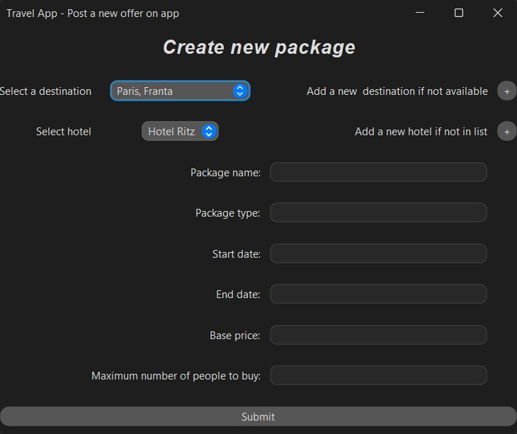
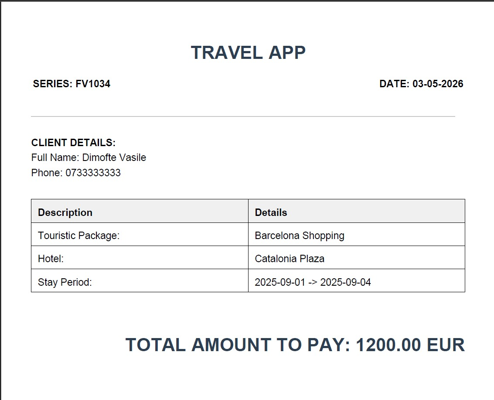

# Package-Based Tourist Application

## Description

We usually want the best possible offers when going on vacation, or sometimes we're just tight on money and start hunting for travel packages. This project is a full Java desktop application for managing a travel agency: clients can browse and book touristic packages, and business users can create new offers and manage hotels, destinations, and guides. Reservations generate a styled PDF invoice automatically.

I built it as a personal project to develop my Java skills, but it also doubled as an optional project for the Object-Oriented Programming lab at university, and the database side covered a project for the Database lab.

## Technologies used

- **Language:** Java
- **UI:** Java Swing + FlatLaf (Mac Dark theme)
- **Database:** PostgreSQL
- **PDF:** OpenPDF

## Features

### Authentication
Login and registration with role-based access (`CLIENT` / `BUSINESS`).

<p align="center">
  
</p>
<p align="center">
  
</p>

### Client dashboard
Browse touristic packages, view package details, and make reservations.

<p align="center">
  
</p>
<p align="center">
  
</p>

### Business dashboard
Create new offers (packages) tied to a hotel, destination, and guides.

<p align="center">
  
</p>

### Account management
Update personal info (name, email, phone, password).

<p align="center">
  
</p>

### Reservations
Book a package for one or more people and see reservation history.

<p align="center">
  
</p>

### PDF invoices
Every reservation produces an `Invoice_FV<series>.pdf` (OpenPDF) that opens automatically after generation.

<p align="center">
  
</p>

## Database

The schema lives in [`database.sql`](database.sql). Tables (Romanian names):

- `destinatii` — destinations (country, city, climate)
- `hoteluri` — hotels (1–5 stars, address, FK to destination)
- `ghizi` — guides (name, phone, spoken language)
- `pachete_turistice` — touristic packages (dates, base price, seats, FK to hotel)
- `pachete_ghizi` — many-to-many between packages and guides
- `clienti` — users (with `rol` = `CLIENT` or `BUSINESS`, default password `1234`)
- `rezervari` — reservations (status, party size, FKs to client/package)
- `facturi` — invoices (series, total, FK to reservation)

### Setup

1. Install PostgreSQL and create a database, e.g. `tourist_app`.
2. Run `database.sql` against it:
   ```bash
   psql -U postgres -d tourist_app -f database.sql
   ```
3. (Optional) seed a few destinations, hotels, guides, and a `BUSINESS` user to log in with.

## Running the app

1. Open the project in IntelliJ IDEA.
2. Add the JDBC driver and dependencies to the project libraries:
   - `postgresql` JDBC driver
   - `flatlaf` (provides `FlatMacDarkLaf`)
   - `openpdf` (`com.lowagie.text`)
3. Configure your DB credentials in [`src/app/util/DataBaseConnection.java`](src/app/util/DataBaseConnection.java):
   ```java
   private static final String url = "jdbc:postgresql://localhost:5432/tourist_app";
   private static final String user = "postgres";
   private static final String password = "your-password";
   ```
4. Run `app.Main`.

## Roles

- **CLIENT** — default role on registration. Sees the client dashboard, can browse packages and book.
- **BUSINESS** — agency staff. Can create new offers (packages) and manage catalog data.

The role check lives in `Client.isBusiness()` and gates the business-only dashboards.

## Invoices

After a reservation is confirmed, `BillGenerator.generateBill(...)` writes an A4 PDF named `Invoice_FV<series>.pdf` to the project root and opens it with the system's default PDF viewer. A few sample invoices are checked in (`Invoice_FV1029.pdf` … `Invoice_FV1033.pdf`).

## Known issues

- Guide assignment to a new package is currently missing.
